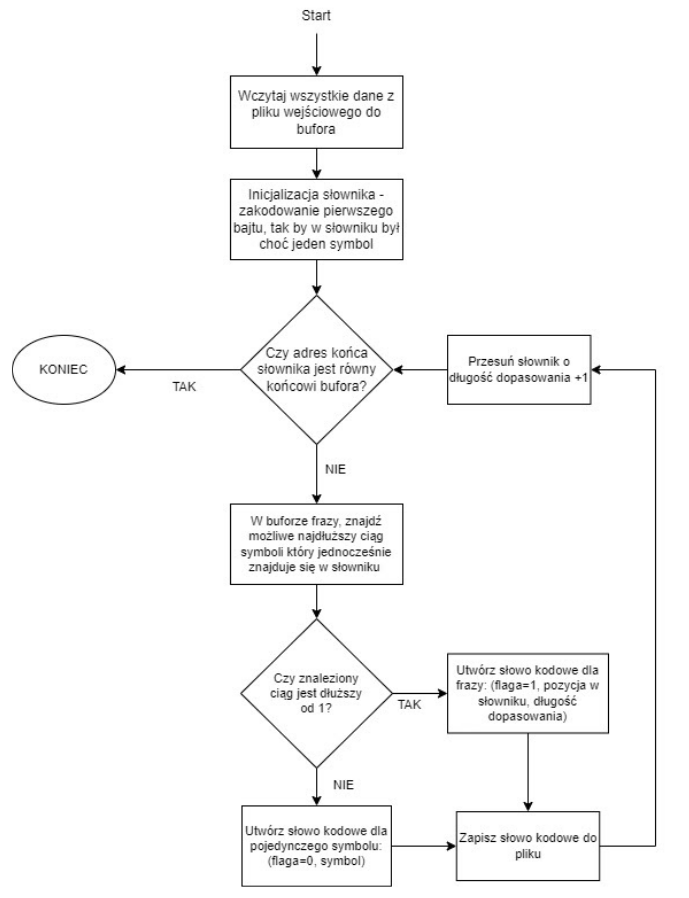
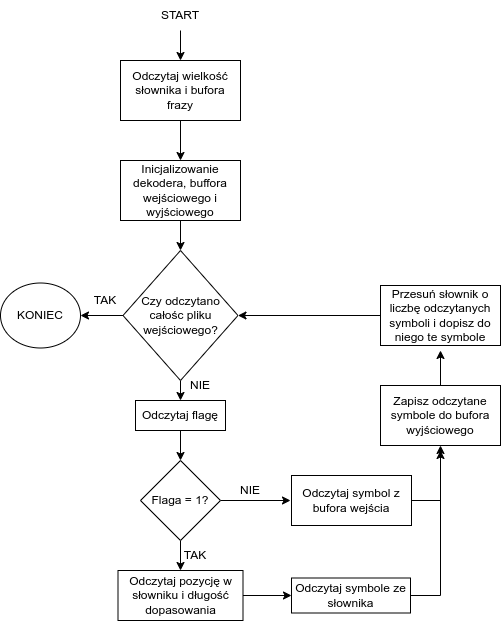

---
title: "Dynamiczne kodowanie słownikowe LZSS"
subtitle: "Realizacja trzeciego etapu projektu"
author: [Domański Piotr, Pietrowcew Jakub, Skórka Kornel]
date: "2022-01-30"
titlepage: true
...

# Implementacja algorytmu LZSS

Projekt został zaimplementowany w języku C++. Składa się z dwóch oddzielnych programów: kodera `coder_lzss` oraz dekodera `decode_lzss`. Oba programy posiadają jedynie interfejs konsolowy i są sterowane za pomocą parametrów ich wywołania.

## Koder LZSS

### Wywołanie

Argumentami wywołania kodera są:

- nazwa pliku wejściowego (kodowanego)
- nazwa pliku wyjściowego
- rozmiar słownika wyrażony w bajtach
- rozmiar bufora frazy wyrażony w bajtach

Rezultatem poprawnego wykonania programu są dwa pliki. Pierwszy plik o nazwie zgodnej z argumentem wywołania zwierające zakodowane dane. Drugi natomiast zawiera statystyki związane z procesem kodowania, a jego nazwa tworzona jest jako: nazwa_zakodowanego_stats.txt. Zawiera on poniższe dane:

- informację o wielkości słownika
- informację o wielkości bufora
- informację o czasie kodowania
- wielkość pliku przed kompresją
- wielkość pliku po kompresji
- stopień kompresji
- liczbę słów kodowych
- średnią długość bitową

### Kluczowe szczegóły implementacji algorytmu kodera

{ width=70% }

Cała zawartość pliku, który ma zostać zakodowany jest na początku wczytywana do bufora “wejściowego” o rozmiarze równym wielkości pliku. Takie podejście jest wystarczające biorąc pod uwagę niewielkie rozmiary plików wejściowych oraz ilość pamięci dostępnej we współczesnych komputerach. Jednakże lepszym podejściem byłoby wczytywanie do bufora tylko części pliku wejściowego, tak aby przy rozmiarach plików wejściowych rzędu setek MB nie alokować, takich ilości pamięci.

Słownik jest implementowany jako wskaźnik, który informuje, gdzie znajduje się w danym momencie początek słownika w buforze “wejściowym”. Poza wskaźnikiem przechowujemy bieżącą długość słownika. Długość słownika jest nie większa niż maksymalna długość słownika podana jako parametr wywołania - na początku działania algorytmu, po inicjalizacji słownika jego długość wynosi jeden i rośnie do maksymalnej dopuszczalnej wartości wraz z wykonywaniem algorytmu.

Słowa kodowe w postaci bitów są tworzone poprzez wykonywanie operacji bitowych (alternatywy i przesunięć) na zmiennej typu unsigned int o rozmiarze 32 bitów - odbywa się to w metodzie WriteBits klasy BitBuf. Po zapełnieniu 32 bitów zmiennej typu unsigned int jest ona umieszczana w buforze \_puiBuf będącym polem prywatnym klasy BitBuf. Bufor ten jest cyklicznie zapisywany do pliku wyjściowego. Pewnym problem okazała się sytuacja, gdy na koniec kodowania 32 bitowa zmienna typu unsigned int była tylko częściowo wypełniona bitami związanymi ze słowem kodowym i to w taki sposób, iż nie były to pełne bajty (do pliku najmniej możemy zapisać 1 bajt) tylko np. 10 z 32 bitów. W takim przypadku bity pozostałe do pełnego bajtu ustawiane były na wartość jeden. Takie uzupełnienie jedynkami dla było jednocześnie sposobem na poinformowaniu dekodera o końcu sekwencji kodowej. Ponieważ dekoder napotykając uzupełniające jedynki będzie w pierwszej kolejności postępował tak jakby dekodował słowo kodowe dla frazy (odczyta bit flagi = 1), ale bitów będzie mniej niż dla typowego słowa kodowego frazy, bądź w skrajnym przypadku odczyta że dopasowanie o maksymalnej długości zaczyna się na końcu słownika, co jest naturalnie niemożliwe. 

## Dekoder LZSS

### Wywołanie

Argumentami wywołania dekodera są:

- zakodowany plik
- wskazanie na docelowy plik ze zdekodowanymi danymi
- ewentualne wskazanie na plik ze statystykami

Rezultatem poprawnego wywołania dekodera jest odkodowanie danych do wskazanego pliku docelowego. Dodatkowo, jeżeli został podany plik ze statystykami zostanie do niego dopisania informacja o czasie dekodowania.

### Kluczowe szczegóły implementacji algorytmu dekodera

{ width=70% }

# Dane testowe

W pierwszej kolejności, w celu sprawdzenia poprawności działania przygotowanego algorytmu upewniono się, czy pliki przed kompresją są identyczne z plikami otrzymanymi po przejściu procesu kompresji i dekompresji. Oczywiście takie sprawdzenie jest możliwe tylko dla algorytmów kompresji bezstratnej, do której zalicza się kodowanie słownikowe LZSS.

Rozmiar plików testowych podlegających kodowaniu wynosił 262 182 bajty dla obrazów i 262 159 bajty dla rozkładów.

## Testy dla: słownika = 4096 i bufora frazy = 32 bajty

| Nazwa pliku     | Czas kodowania [ms] | Czas dekodowania [ms] | Rozmiar po kodowaniu [bajty] | Wsp. kompresji | Liczba słów kodowych | Średnia długość bitowa |
|-----------------|---------------------|-----------------------|------------------------------|----------------|----------------------|------------------------|
| barbara.pgm     | 550                 | 880                   | 280 576                      | 0,93           | 178 892              | 12,5473                |
| boat.pgm        | 492                 | 982                   | 276 096                      | 0,95           | 156 878              | 14,0795                |
| chronometer.pgm | 431                 | 799                   | 185 344                      | 1,41           | 111 105              | 13,3455                |
| lena.pgm        | 487                 | 451                   | 271 872                      | 0,96           | 155 514              | 13,9857                |
| mandril.pgm     | 592                 | 1106                  | 284 928                      | 0,92           | 175 942              | 12,9555                |
| peppers.pgm     | 299                 | 306                   | 181 888                      | 1,44           | 89 507               | 16,2569                |
| geometr_05.pgm  | 607                 | 411                   | 103 552                      | 2,53           | 46 405               | 17,8519                |
| geometr_09.pgm  | 554                 | 769                   | 250 752                      | 1,05           | 119 755              | 16,751                 |
| geometr_099.pgm | 721                 | 1051                  | 294 656                      | 0,89           | 233 412              | 10,0991                |
| laplace_10.pgm  | 567                 | 973                   | 285 824                      | 0,92           | 153 096              | 14,9357                |
| laplace_20.pgm  | 655                 | 717                   | 293 376                      | 0,89           | 191 261              | 12,2712                |
| laplace_30.pgm  | 637                 | 727                   | 294 400                      | 0,89           | 215 992              | 10,9041                |
| normal_10.pgm   | 547                 | 439                   | 282 112                      | 0,93           | 138 604              | 16,2831                |
| normal_30.pgm   | 649                 | 415                   | 294 144                      | 0,89           | 205 102              | 11,4731                |
| normal_50.pgm   | 751                 | 784                   | 294 656                      | 0,89           | 234 429              | 10,0553                |
| uniform.pgm     | 744                 | 1220                  | 294 784                      | 0,89           | 247 271              | 9,5372                 |

## Testy dla: słownika = 2048 i bufora frazy = 32 bajty
## Testy dla: słownika = 1024 i bufora frazy = 32 bajty
## Testy dla: słownika = 2048 i bufora frazy = 64 bajty

# Histogram i entropia danych wejściowych

# Entropia źródła blokowego rzędu 2 i 3

# Porównanie średniej długości bitowej kodu wyjściowego z wyliczonymi entropiami

# Ocena efektywności algorytmu do kodowania obrazów naturalnych.

